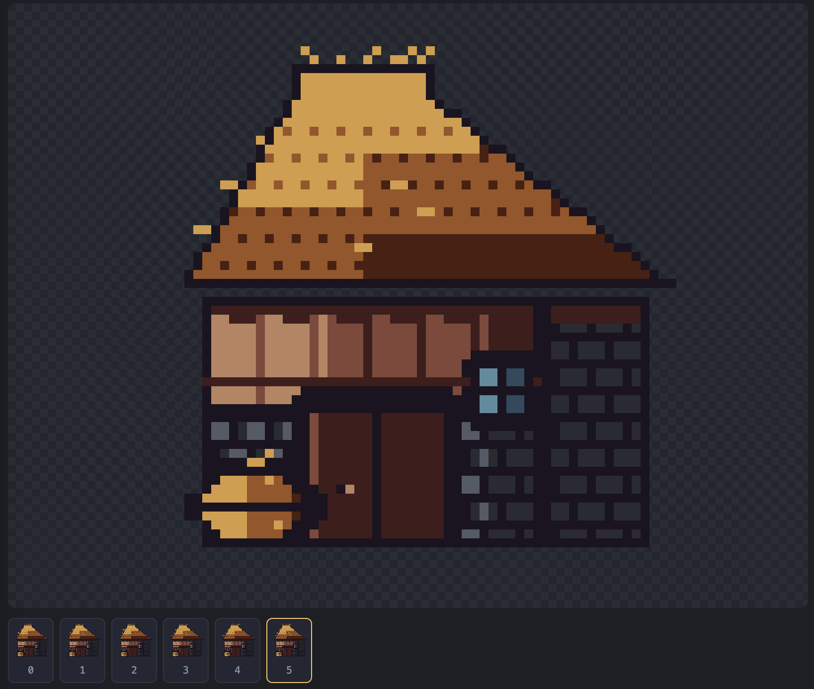

# harness_pixelart

A pipeline for making **real pixel art** with an AI agent -- the kind a person
would draw, not a downscaled photo and not a picture assembled out of rectangles.

Give it reference images and a description; get back a craft-checked sprite or
animation, its text source, and game-ready exports.

Works identically in **Claude Code** and **Codex CLI** (and anything else that
reads the [Agent Skills](https://agentskills.io) standard), from one copy of the
skill.

---

## Showcase



A 64x64 stable, drawn stage by stage (silhouette → flats → shading → cleanup →
animation) from a single reference image and a one-line brief. The roof is
individually coursed thatch, the walls are coursed stone and grained timber
plank by plank, and the 6-frame loop is gusts of wind rippling across the
bundles while the loose ends sway at the ridge and eaves -- not a filter, not a
downscaled photo, drawn the way a person would draw it. Live in `px studio`,
mid-frame, with the filmstrip along the bottom. Source at
`workspace/stable/stable.pxa`.

---

## Why it is built this way

Published experiments in having language models draw pixel art hand them
primitive drawing tools -- `draw_pixel`, `draw_line`, `fill` -- and the results
come out blocky and basic. The conclusion of the best-known write-up is that
*tool granularity fundamentally constrains output quality*.

So this pipeline does not give the model a brush. It gives it three things:

1. **A text format.** A sprite is a palette plus a grid of characters. The model
   edits it the way it edits code -- precisely, in place, seeing the whole thing
   at once. Palette keys are ordered by visual density, so the raw text reads as
   a rough picture of the sprite.

2. **Eyes.** Every editing pass ends with a review sheet: the sprite blown up
   with a coordinate grid, next to its actual 1x size, its silhouette, and its
   value study. The model opens that image and critiques its own work. This loop
   is where the quality comes from.

3. **A craft linter.** The rules of pixel art -- jaggies, doubles, orphan
   pixels, banding, pillow shading, dead ramps, dither spray, and for animation
   volume drift and anchor drift -- are geometric and measurable. The linter
   measures them and says where. It catches exactly what the model cannot see.

---

## How to use this harness

1. **Install the skill once.** Drop `.agents/skills/pixel-art` (and, if you
   want the live viewer, `pixel-art-studio`) into a repo that Claude Code or
   Codex reads skills from -- this repo already has them wired up via
   `.claude/skills -> ../.agents/skills`.

2. **Check the environment.**

   ```bash
   px doctor
   ```

   Confirms the Python version, whether Pillow is available (only needed to
   read JPEG/WebP references), and how many bundled palettes are found.

3. **Start a project and drop in references.**

   ```bash
   px project workspace/knight --name knight   # brief.md, refs/, history/, out/
   cp ~/some/refs/*.png workspace/knight/refs/
   ```

4. **Ask for the sprite in plain language**, in Claude Code or Codex, from
   this repo:

   > "draw me a 32x32 knight in the style of these references, with a
   > 4-frame idle where he shifts his weight"

   The agent runs `px ref` on your images, writes `brief.md` from what it
   measured (palette, value range, outline convention, hue shift -- not
   assumptions), then works the pipeline in order: **silhouette → flats →
   shading → cleanup → animation**. After every editing pass it renders
   `px view` and looks at the result before touching the grid again; before
   calling anything finished it runs `px lint --verbose` and either fixes
   every finding or says why it kept one.

5. **Watch it happen live** (optional, but the best way to review the work):

   ```bash
   px studio --dir workspace --open
   ```

   Terminal on one half of the screen, browser on the other. The page
   re-renders on every save, plays the animation at its real per-frame
   timing, replays the build's `history/` snapshots as a time-lapse, shows
   the live craft findings, and hands over every export as a download --
   that's the screenshot above.

6. **Ship it.**

   ```bash
   px export workspace/knight/knight.pxa --fps 8
   ```

   Writes PNGs at 1x/2x/4x, a spritesheet with a JSON manifest, a GIF, the
   palette as `.hex`/`.gpl`, and an Aseprite `.lua` rebuild script into
   `workspace/knight/out/`.

Everything above is one command surface, `bin/px`; `px --help` lists every
subcommand.

---

## Layout

```
.agents/skills/          skills (the standard's REPO scope -- Codex reads this natively)
  pixel-art/
    SKILL.md             the pipeline
    references/          craft, colour, animation, format, workflow, troubleshooting
    scripts/             the toolchain (standard library only)
    assets/palettes/     14 bundled palettes + attribution
    assets/studio.html   the live viewer
  pixel-art-studio/      starting the viewer
.claude/skills           symlink -> ../.agents/skills
AGENTS.md                repo rules
CLAUDE.md                symlink -> AGENTS.md
bin/px                   one command for everything
workspace/               one folder per sprite
```

One copy of everything. `.claude/` contains a symlink and nothing else.

---

## The toolchain

```
px ref IMG...                  study references: native size, palette, ramps,
                               value range, hue shift, dither density, outline
px new FILE --size 32x32 --palette sweetie-16
px view FILE                   the review sheet you must actually look at
px grid FILE --palette         the grid as text with a coordinate ruler
px lint FILE --verbose         the craft check
px fix FILE --orphans --dedupe --prune
px palette list|extract|ramp|get lospec:SLUG|apply
px import IMG --out FILE       raster -> draft (a draft, never a deliverable)
px sheet IMG --frame-size 32x32 --out FILE
px anim add|timing|drift|stats|gif
px strip FILE                  filmstrip     px onion FILE --frame N
px diff A B --image OUT.png    px snapshot FILE --stage NAME
px export FILE --fps 8         PNGs, spritesheet + JSON, GIF, .hex, .gpl, Aseprite .lua
px studio --dir workspace      the live viewer
```

Python 3.8+, standard library only. Pillow is optional and only needed to read
JPEG/WebP references (`px doctor --install` sets it up). No account, no API key,
no network -- except `px palette get lospec:<slug>`.

---

## The format

```
@meta
name: swordsman
size: 32x32
light: top-left
fps: 6

@palette
. #00000000 transparent
@ #1a1c2c   ink
% #29366f   cloth-shadow
M #3b5dc9   cloth
X #ef7d57   skin
+ #ffcd75   hair

@frame idle0
............@@@@@...............
...........@+++++@..............
...........@+@X@N@..............
```

Plain text: diffable, greppable, editable with any tool, readable by eye.

---

## Examples

Both are worked end to end, with `history/` snapshots at every stage -- open
either in the studio to watch the time-lapse:

- `workspace/stable/` -- a 64x64 stable with coursed stone, grained timber and
  a 6-frame thatch-in-the-wind loop (the showcase above).
- `workspace/swordsman/` -- a 32x32 swordsman with a 4-frame idle (weight
  shift, breath, planted sword).

---

## Tests

```bash
python3 tests/run_tests.py
```

Exercises the format round-trip, the renderer, every linter rule, the palette
maths, the animation checks, the GIF encoder, and the exports.

---

## Credits

Bundled palettes belong to their authors -- see
`.agents/skills/pixel-art/assets/palettes/ATTRIBUTION.md`. Everything else is
MIT.
