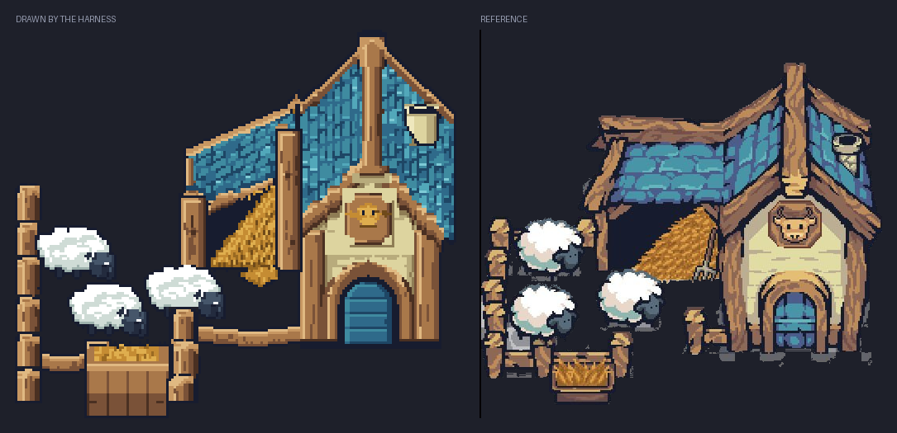
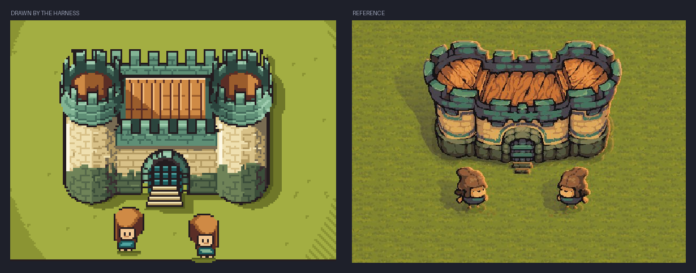
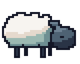

# harness-pixelart

A pipeline for making **real pixel art** with an AI agent -- the kind a person
would draw, not a downscaled photo and not a picture assembled out of rectangles.

Give it reference images and a description; get back a craft-checked sprite or
animation, its text source, and game-ready exports.

Works identically in **Claude Code** and **Codex CLI** (and anything else that
reads the [Agent Skills](https://agentskills.io) standard), from one copy of the
skill.

---

## Showcase

Two buildings drawn by the pipeline from the reference images beside them --
same subject, same craft, not a copy and not a downscale.



**184x164, camera `pitch=26.57 yaw=0`, 25 colours.** Slate laid course by
course, hand-cut log posts with sawn ends and sagging rails, hay spilling out
of the loft, an arched plank door under a cow-head sign, and three sheep
overlapping the fence. Built as volumes first, then painted by hand.
Source: `workspace/farm/`.



**192x144, camera `pitch=35.26 yaw=0`, 29 colours.** Two round towers with a
four-step value gradient around each cylinder, a crenellated parapet with deep
shadow under its overhang, a black gate mouth behind a portcullis, and two
guards for scale. The artist derived the camera angle by measuring how much the
towers' top ellipses were squashed in the reference. Source: `workspace/castle/`.

<p align="center">
  
</p>

**40x32, 12 frames, a 2.2-second loop.** The layers peak at different frames so
nothing moves as one rigid blob: a fleece crest lifts before the back does, the
belly settles two frames after, a slow head dip carries a faster jaw for the
chew, the ear flicks once, the eye blinks twice. The hooves never move --
`px anim drift` reports zero drift in volume, height and anchor across the
whole loop. Source: `workspace/sheep/`.

---

## Why it is built this way

Published experiments in having language models draw pixel art hand them
primitive drawing tools -- `draw_pixel`, `draw_line`, `fill` -- and the results
come out blocky and basic. The conclusion of the best-known write-up is that
*tool granularity fundamentally constrains output quality*.

So this pipeline does not give the model a brush. It gives it four things:

1. **A text format.** A sprite is a palette plus a grid of characters. The model
   edits it the way it edits code -- precisely, in place, seeing the whole thing
   at once. Palette keys are ordered by visual density, so the raw text reads as
   a rough picture of the sprite.

2. **Eyes.** Every editing pass ends with a review sheet: the sprite blown up
   with a coordinate grid, next to its actual 1x size, its silhouette, and its
   value study. The model opens that image and critiques its own work. This loop
   is where the quality comes from.

3. **A craft linter.** The rules of pixel art -- jaggies, doubles, orphan
   pixels, banding, pillow shading, dead ramps, dither spray, and for animation
   volume drift and anchor drift -- are geometric and measurable. The linter
   measures them and says where. It catches exactly what the model cannot see.

4. **A way to think in three dimensions.** A character reads through its
   silhouette; a building reads through its *volumes*. Asked for a 3/4 or
   isometric building, a model that draws silhouette-first produces a flat
   front elevation every time -- the text grid makes horizontal and vertical
   edges free and slanted ones expensive, so it draws what is cheap. So
   buildings are not drawn first: they are **built** first, as boxes, roofs
   and cylinders in world units, and projected by the toolchain with the
   camera the references actually use. The model paints on top of a
   construction whose slopes, face tones, cast shadows and texture directions
   are already correct.

---

## Two pipelines, one intake

Every job starts the same way: study the references, write the brief, pass the
gate. Then the subject class picks the pipeline.

| class | examples | pipeline |
| --- | --- | --- |
| `character`, `prop` | people, creatures, items, icons | **silhouette-first**: silhouette, flats, shading, cleanup, animation |
| `structure`, `scene` | buildings, vehicles, furniture, a whole farmyard | **massing-first**: massing, surfaces, openings, props, outline & light, cleanup |

The intake is not advisory. `px ref` measures the references' **projection**
(from the histogram of their edge angles), their **native pixel scale** (even
through a JPEG upscale) and the **size of the subject**; `px brief` then
refuses to let work start until the brief declares a class, a camera, a canvas
that is not smaller than the subject, a palette and a light direction.

### The camera

The projection is stated the way a person thinks about a camera -- tilt it
down, turn it around -- in degrees:

```
view: camera pitch=26.57 yaw=0
```

| | |
| --- | --- |
| `pitch=0` | side view, no top surfaces |
| `pitch=26.57` | the RPG tilt: the ground foreshortens 1:2 |
| `pitch=90` | straight down |
| `yaw=0` | the front wall faces the viewer -- the 3/4 top-down look |
| `yaw=45` | corner-on -- isometric |

`pitch=26.57 yaw=45` is exactly pixel isometric 2:1; `pitch=35.26 yaw=45` is
true 30-degree isometry. The renderer warns when a chosen angle produces
slopes that cannot step cleanly in pixels, and names the nearest angle that
can.

### The scene file

```
@scene
name: farm
view: camera
pitch: 26.57
yaw: 26.57
unit: 7
light: top-left

@materials
plaster  #d9caa0  #a08f68  #f2e6c0
roof     #3f7f96  #275a70  #6fb0c0   texture=shingles.tex

@objects
ground  yard   at=-5,-5,0    size=34,26     mat=grass
box     house  at=0,0,0      size=9,8,7     mat=plaster
gable   hroof  at=-1.5,-1,7  size=12,10,5   mat=roof   ridge=y
cyl     silo   at=16,3,0     r=2.5 h=7      mat=stone
```

`px scene render` projects it, shades every face by the orientation of its
plane, projects the material textures onto the faces so courses follow the
form, casts real shadows from the light direction, and writes a `.pxa` plus a
guide image with the wireframe and face names. From there the model paints,
and `px lint` checks the painting still obeys the construction: `form-value`
(a face may not lose its tone rank), `form-coverage` (the paint may not drift
off the massing), `iso-slope` (2:1 edges stay 2:1), `plane-drift` (details
must shear with the plane they sit on).

---

## How to use this harness

1. **Install the skill once.** Drop `.agents/skills/pixel-art` (and, if you
   want the live viewer, `pixel-art-studio`) into a repo that Claude Code or
   Codex reads skills from -- this repo already has them wired up via
   `.claude/skills -> ../.agents/skills`.

2. **Check the environment.**

   ```bash
   px doctor
   ```

   Confirms the Python version, whether Pillow is available (only needed to
   read JPEG/WebP references), and how many bundled palettes are found.

3. **Start a project and drop in references.**

   ```bash
   px project workspace/knight --name knight   # brief.md, refs/, history/, out/
   cp ~/some/refs/*.png workspace/knight/refs/
   ```

4. **Ask for the sprite in plain language**, in Claude Code or Codex, from
   this repo:

   > "draw me a 32x32 knight in the style of these references, with a
   > 4-frame idle where he shifts his weight"

   The agent runs `px ref` on your images, writes `brief.md` from what it
   measured (projection, subject size, palette, value range, outline
   convention, hue shift -- not assumptions), passes `px brief`, and then
   works whichever pipeline the class calls for: **silhouette → flats →
   shading → cleanup → animation** for a character, or **massing → surfaces →
   openings → props → outline & light → cleanup** for a building. After every
   editing pass it renders `px view` and looks at the result before touching
   the grid again; before calling anything finished it runs `px lint
   --verbose` and either fixes every finding or says why it kept one.

5. **Watch it happen live** (optional, but the best way to review the work):

   ```bash
   px studio --dir workspace --open
   ```

   Terminal on one half of the screen, browser on the other. The page
   re-renders on every save, plays the animation at its real per-frame
   timing, replays the build's `history/` snapshots as a time-lapse, shows
   the live craft findings, and hands over every export as a download --
   that's the screenshot above.

6. **Ship it.**

   ```bash
   px export workspace/knight/knight.pxa --fps 8
   ```

   Writes PNGs at 1x/2x/4x, a spritesheet with a JSON manifest, a GIF, the
   palette as `.hex`/`.gpl`, and an Aseprite `.lua` rebuild script into
   `workspace/knight/out/`.

Everything above is one command surface, `bin/px`; `px --help` lists every
subcommand.

---

## Layout

```
.agents/skills/          skills (the standard's REPO scope -- Codex reads this natively)
  pixel-art/
    SKILL.md             the two pipelines
    references/          structures, craft, colour, animation, format,
                         workflow, troubleshooting
    scripts/             the toolchain (standard library only)
    assets/palettes/     14 bundled palettes + attribution
    assets/textures/     brick, shingle, plank and thatch tiles
    assets/scenes/       worked example scenes
    assets/studio.html   the live viewer
  pixel-art-studio/      starting the viewer
.claude/skills           symlink -> ../.agents/skills
AGENTS.md                repo rules
CLAUDE.md                symlink -> AGENTS.md
bin/px                   one command for everything
workspace/               one folder per sprite
```

One copy of everything. `.claude/` contains a symlink and nothing else.

---

## The toolchain

```
px ref IMG...                  study references: native size, projection,
                               subject size, palette, ramps, value range,
                               hue shift, dither density, outline
px brief DIR                   the gate: class, camera, canvas, palette, light
px new FILE --size 32x32 --palette sweetie-16
px scene new|render|guide|faces FILE.scene    massing for buildings
px view FILE                   the review sheet you must actually look at
px grid FILE --palette         the grid as text with a coordinate ruler
px lint FILE --verbose         the craft check
px fix FILE --orphans --dedupe --prune
px palette list|extract|ramp|get lospec:SLUG|apply
px import IMG --out FILE       raster -> draft (a draft, never a deliverable)
px sheet IMG --frame-size 32x32 --out FILE
px anim add|timing|drift|stats|gif
px strip FILE                  filmstrip     px onion FILE --frame N
px diff A B --image OUT.png    px snapshot FILE --stage NAME
px export FILE --fps 8         PNGs, spritesheet + JSON, GIF, .hex, .gpl, Aseprite .lua
px studio --dir workspace      the live viewer
```

Python 3.8+, standard library only. Pillow is optional and only needed to read
JPEG/WebP references (`px doctor --install` sets it up). No account, no API key,
no network -- except `px palette get lospec:<slug>`.

---

## The format

```
@meta
name: swordsman
size: 32x32
light: top-left
fps: 6

@palette
. #00000000 transparent
@ #1a1c2c   ink
% #29366f   cloth-shadow
M #3b5dc9   cloth
X #ef7d57   skin
+ #ffcd75   hair

@frame idle0
............@@@@@...............
...........@+++++@..............
...........@+@X@N@..............
```

Plain text: diffable, greppable, editable with any tool, readable by eye.

---

## Examples

All are worked end to end, with `history/` snapshots at every stage -- open any
of them in the studio to watch the time-lapse of how it was built:

**Pipeline B -- massing-first**

- `workspace/farm/` -- a 184x164 sheep farm: `farm.scene` is the construction,
  `farm.pxa` the painting. 14 snapshots, including an honest rebuild when the
  artist measured the reference and found the house 60% too tall.
- `workspace/castle/` -- a 192x144 castle keep with round towers, drawn at a
  camera angle derived from the reference's tower ellipses.

**Pipeline A -- silhouette-first**

- `workspace/sheep/` -- a 40x32 sheep with a 12-frame, 2.2-second idle loop.
- `workspace/swordsman/` -- a 32x32 swordsman with a 4-frame idle (weight
  shift, breath, planted sword).
- `workspace/stable/` -- a 64x64 stable with a 6-frame thatch-in-the-wind loop.
  Drawn before the massing pipeline existed, and a good illustration of why it
  had to: it is a flat front elevation, because a building drawn
  silhouette-first always is.

---

## Tests

```bash
python3 tests/run_tests.py
```

63 tests covering the format round-trip, the scene renderer (projections,
shading, cast shadows, textures, canvas fitting), every linter rule including
the structure ones, the reference study, the brief gate, the palette maths, the
animation checks, the GIF encoder, and the exports.

---

## Credits

Bundled palettes belong to their authors -- see
`.agents/skills/pixel-art/assets/palettes/ATTRIBUTION.md`. Everything else is
MIT.
